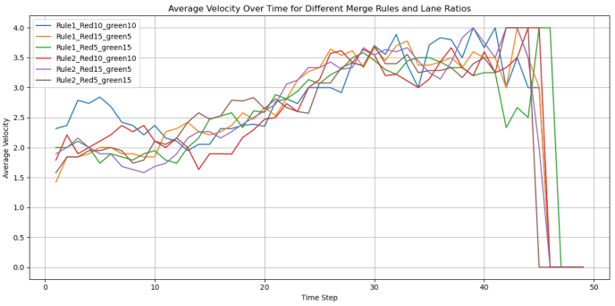
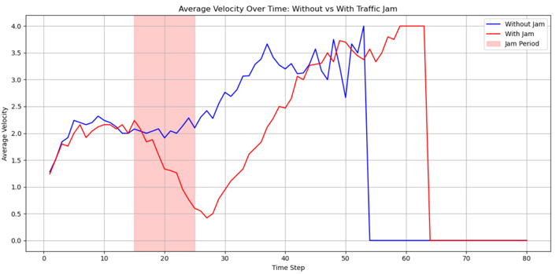

# Network Resilience Simulation: Road Conflation & Traffic Jams

This repository implements a Cellular Automata (CA) model to simulate network resilience under traffic congestion. Utilizing the Nagel-Schreckenberg model, the simulation evaluates vehicle dynamics during lane merging and induced bottlenecks.

## Background & Methodology

The simulation divides a road into discrete cells and models vehicle behavior through four fundamental rules: acceleration (up to a limit $v_{max}$), braking (to avoid collisions), randomization/dawdling (representing human reaction delay), and forward movement[cite: 3]. 

The primary scenarios evaluated include:
1. **Street Conflation:** Simulating two lanes ("green" and "red") merging into a single lane. Priority rules resolve merge conflicts:
   * **Rule 1:** The vehicle closest to the conflation point proceeds first.
   * **Rule 2:** The "green" lane maintains strict priority over the "red" lane.
2. **Traffic Jam & Resilience:** An artificial bottleneck is induced by blocking a specific cell for 10 timesteps. The system's resilience is quantified by plotting throughput and average velocity evolution over time as the jam clears.

## Key Findings

### 1. Street Conflation & Priority Rules
We evaluated the average velocity of vehicles merging from two lanes into one under varying lane densities and priority rules. 

*Figure 1: Average Velocity Over Time for Different Merge Rules and Lane Ratios. The simulation shows how traffic speed evolves as vehicles interact at the conflation point. Velocity eventually stabilizes before dropping sharply at the end of the simulation as vehicles exit the grid.*

### 2. Network Resilience Under Congestion
To test system resilience, an artificial bottleneck was introduced by blocking a specific cell for 10 timesteps, forcing the traffic to halt and form a jam. 

*Figure 2: Average Velocity Over Time: Without vs. With Traffic Jam. The red shaded area highlights the 10-timestep blockage. The system demonstrates measurable resilience; average velocity drops significantly during the jam but smoothly recovers to match unhindered traffic flow shortly after the bottleneck is removed.*
